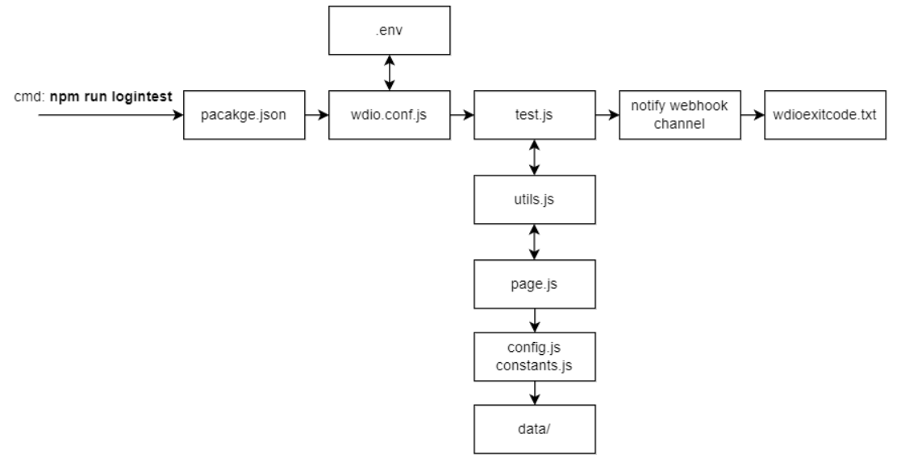

# Ui test automation with WebdriverIO v8

#### Javascript Mocha framework with Test Driven Development (TDD) nature

---

### Pre-requisite

Install

- Node 18.12.1
- NVM (Recommended to switch between multiple node versions)

In case of any error related to python, install

- Python 3.11.0 (Windows user need to install manually, others have Python pre-installed)

---

### Framework Overview

We have,

- POM (Page Object Model) for handling the web element locators / related methods (landingPage / loginPage..),
- Generalized test support methods under Utils folder,
- Test files under data folder,
- Test config, constants under configurations folder,
- Test execution with Chrome Browser (Headless/Gui mode - wdio.conf.js),
- Configured Allure/Spec Reporter (wdio.conf.js),
- Hook class to handle browser launch, baseUrl, screenshots, notify webhook channel (wdio.conf.js),
- Test Execution configurations - docker service, parallel execution (wdio.conf.js),
- Docker Support for Test execution with selenium-hub and browsers chrome, firefox, edge,
- .env file to handle all environment values,

### One Time Setup

From the terminal of `wdio_base`, run the below cmds

    1) 'npm i --force': To install all dev dependencies from package.json file
        - Adding --force due to version issue between @wdio/allure-reporter v7.26.0 & wdio v8 (ESM compatibility issue)
        - After this cmd, we will get folder `node_modules` with all dependencies downloaded

    2) Create a .env file within wdio_base folder and pass the required env variables for test
        - GUI=false (headless mode)
        - SITE_URL=siteURL
        - USER_EMAIL_ID=activeUser@email.com
        - PASSWORD=*****
        - DOCKER_SERVICE=true (If false, chrome driver service will be used)
        - GOOGLE_CHAT_WEBHOOK=webhookUrl (Upon test execution completion, test status pass/fail will be notified to channel)

### Steps to Run test (Locally)

From the terminal of `wdio_base`, run the below cmds

    1) 'npx wdio wdio.conf.js --suite suiteName': Will run the test as per suite definition in wdio.conf.js
        - npx wdio wdio.conf.js --suite loginTest will run the login.test.js file

        or

        'npm run logintest' will run the logintest as defined in package.json file under scripts section.

    2) 'allure generate && allure open' will create allure report and open up the report in browser
        - 'allure generate --clean && allure open' --clean need to be added for next run test report

If we get allure not found error, install [Allure](https://www.programsbuzz.com/article/how-install-allure-windows) to your machine

---

### Steps to Run test (Docker)

After installing docker, from the terminal of `wdio_base`,

    1) Run the below cmd
        'SITE_IMAGE=d442cdb4f03e SITE_URL=siteURL SUITE_NAME=logintest docker-compose up'
            - SITE_IMAGE - Pass the docker image id
            - SITE_URL - Pass the site url, if no value takes the default value as in file
            - SUITE_NAME - Pass the test suite to execute

    2) After, test execution down the docker services
        'SITE_IMAGE=d442cdb4f03e SITE_URL=siteURL SUITE_NAME=logintest docker-compose down'

    3) We can also remove stopped services by
        'SITE_IMAGE=d442cdb4f03e SITE_URL=siteURL SUITE_NAME=logintest docker-compose rm'

### Test Flow across file/folder in framework

